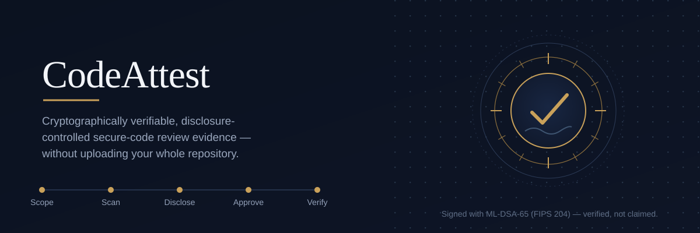
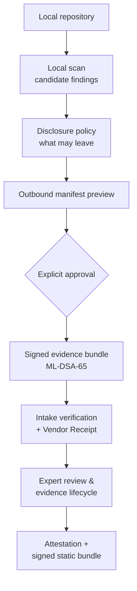

# CodeAttest

**Cryptographically verifiable, disclosure-controlled secure-code review evidence — without uploading your whole repository.**

[](https://github.com/josz5930/CodeSanctum/actions/workflows/ci.yml)
[](./LICENSE)


CodeAttest is an open-source, protocol-first workflow for producing secure-code
review evidence you can actually verify. A customer-side runner analyzes code
inside your own environment, you decide what may leave it, and the receiving side
can prove exactly what it got. The output is a claim-safe evidence package — not
an unqualified "certified secure" stamp.

Run it, fork it, modify it, or reuse individual components under the
[GPLv3](./LICENSE). This is a project you can build on, not a hosted SaaS. See
[Support policy](#support-policy) for what that means.

> **Names:** the product is **CodeAttest**; the Git repo is **CodeSanctum**; the
> npm/Cargo workspace is `onevps`. Same project — see
> [naming cleanup](./docs/codeattest-naming-cleanup.md).

## Why CodeAttest?

Most secure-code review products start by asking you to upload your entire
repository to someone else's platform. For a regulated or security-conscious
team, that is often the single biggest blocker: you lose control of your source
the moment a review begins.

CodeAttest inverts that. Analysis happens inside your environment, you choose the
scope and exactly what evidence is allowed to leave, you preview the outbound
contents before anything is sent, and transmission requires explicit approval.
Evidence is cryptographically signed, and the receiving side can verify what it
actually received rather than trusting a claim about it.

- **You define the scope** — one application, one commit — not the vendor.
- **You control disclosure**, evidence category by category, via an explicit
  Disclosure Policy and an Outbound Manifest preview shown *before* anything is sent.
- **Nothing leaves without explicit approval.** There is no auto-submit path.
- **Approved-vs-received is verifiable.** The Vendor Receipt lets you compare what
  you approved against what intake actually got — signed with real ML-DSA-65.
- **History is append-only.** Corrections supersede prior events instead of
  silently rewriting them, so the record stays auditable.
- **Output is claim-safe.** Wording is deliberately constrained so it does not
  imply a SOC 2 opinion, ISO/IEC 27001 certification, a security guarantee, or a
  replacement for an auditor. See the [Assurance Boundary](./docs/codeattest-assurance-boundary.md).

## How it works



Steps 1–5 run entirely inside the customer environment and transmit nothing. Only
after explicit approval does a separate `submit` step send the signed bundle. The
[Architecture Overview](./docs/codeattest-architecture-overview.md) walks through
each actor and boundary in plain language.

## Try it

The Rust Local Runner is the customer-side workflow, and it runs fully offline.

```sh
git clone https://github.com/josz5930/CodeSanctum
cd CodeSanctum
npm install
```

### One command

A synthetic demo application is bundled at
[`runner/examples/demo-app/`](./runner/examples/demo-app/), and a single command
drives the entire customer-side workflow against it — scope capture, local scan,
disclosure policy, manifest preview, explicit approval, and a signed local
Evidence Bundle:

```sh
npm run demo
```

It writes all runtime output under a gitignored `.codeattest/demo/` directory and
transmits nothing. (If Rust/Cargo is not installed it prints `PENDING` and exits
cleanly.) The synthetic app carries a deliberate `eval(...)` so the local scanner
produces a Candidate Finding you can watch flow through the pipeline.

### Step by step

The walkthrough below runs the same five-step sequence as `npm run demo`, one
command at a time and with your own review id, approver, and output paths. (The
script itself uses a fixed synthetic review id and approver, writes under
`.codeattest/demo/`, and records an attempt log — see [`scripts/demo.mjs`](./scripts/demo.mjs).)
It uses `metadata_only` coverage so a bundle builds without any source-derived
snippets — point `--application-path` at the bundled demo app, or any local directory.

```sh
# A minimal scanner config for the smoke test
cat > scanner-config.json <<'JSON'
{ "regex_rules": [ { "scanner_name": "regex", "rule_id": "demo.regex.eval",
  "pattern": "eval\\(", "ruleset_identifier": "local:demo-regex",
  "severity": "warning", "confidence": "medium",
  "target_file_group": "typescript_javascript",
  "target_include_patterns": ["src/*.ts"],
  "retain_raw_output_locally": false } ] }
JSON
echo '{ "coverage_mode": "metadata_only" }' > disclosure-policy-config.json

APP=./runner/examples/demo-app   # or any local directory for a metadata-only run

# 1. Capture review scope (application + commit)
cargo run -p onevps-local-runner-scaffold -- scope init \
  --application-path "$APP" \
  --review-id review:my-first-review \
  --commit 0123456789abcdef0123456789abcdef01234567 \
  --output .codeattest/review-scope.json

# 2. Run configured local scanners
cargo run -p onevps-local-runner-scaffold -- scan run \
  --application-path "$APP" --scope .codeattest/review-scope.json \
  --scanner-config ./scanner-config.json --output .codeattest/scanner-findings.json

# 3. Configure what evidence may leave the environment
cargo run -p onevps-local-runner-scaffold -- disclosure configure \
  --scope .codeattest/review-scope.json \
  --scanner-findings .codeattest/scanner-findings.json \
  --policy-config ./disclosure-policy-config.json \
  --output .codeattest/disclosure-policy.json

# 4. Preview exactly what would be sent, before sending anything
cargo run -p onevps-local-runner-scaffold -- manifest preview \
  --scope .codeattest/review-scope.json \
  --scanner-findings .codeattest/scanner-findings.json \
  --disclosure-policy .codeattest/disclosure-policy.json \
  --output .codeattest/outbound-manifest.json

# 5. Explicitly approve and build a signed, local-only evidence bundle
#    --approval-confirmation is the manifest_id printed in step 4
cargo run -p onevps-local-runner-scaffold -- bundle prepare \
  --scope .codeattest/review-scope.json \
  --scanner-findings .codeattest/scanner-findings.json \
  --disclosure-policy .codeattest/disclosure-policy.json \
  --manifest .codeattest/outbound-manifest.json \
  --approving-actor "you@example.com" --approval-decision approve \
  --approval-confirmation <manifest_id-from-step-4> \
  --output-dir .codeattest/evidence-bundle
```

You now have a signed, local-only evidence bundle — nothing was transmitted. All
flags, scanner/policy config options, coverage modes, status/trust commands, and
the explicit `submit send` transport are in [`runner/README.md`](./runner/README.md).

## Build on CodeAttest

**Use the whole system, or take the parts you need.** The architecture is
protocol-first: components validate, project, or transport the contracts in
[`protocol/`](./protocol/README.md) rather than redefining them, so you can
replace or extend a component while keeping the evidence contracts intact.

| Component | What you can reuse |
| --- | --- |
| [Rust Local Runner](./runner/README.md) | Scope capture, local scanning, disclosure policy, manifest preview, approval, deterministic signed bundle build |
| [Evidence protocol](./protocol/README.md) | JSON Schema 2020-12 contracts, canonicalization, identity rules, and fixtures for every artifact |
| [Disclosure + manifest model](./protocol/schemas/) | The disclosure-policy and approved-vs-received / Outbound Manifest model |
| [Signing helpers](./packages/signing/README.md) | Real ML-DSA-65 (FIPS 204) signing/verification over the protocol's canonicalization |
| [Intake verification](./services/intake/README.md) | Bundle verification and Vendor Receipt issuance (pure library functions) |
| [Review & evidence lifecycle](./apps/control-plane/README.md) | Append-only review-event log, classification, remediation, validation, verification, Attestation |
| [Static / offline portal](./packages/static-bundle/README.md) | Signed, content-addressed static bundle + self-contained offline HTML portal |
| [Persistence adapters](./packages/evidence-store/README.md) | Seven append-only ports with memory and Postgres/filesystem adapters behind one contract suite |

## What's implemented

CodeAttest is a **protocol-first pre-release**, not a running product. The schemas,
runner, signing, verification, review logic, persistence, host, and web surface
are real and tested as code; live operation and real customer evidence are
deliberately gated off.

| Area | Status |
| --- | --- |
| Evidence protocol (schemas, canonicalization, fixtures, claim-safety) | Implemented / tested |
| Local Runner (Rust CLI) | Implemented / tested |
| ML-DSA-65 signing & verification | Implemented / tested (software custody) |
| Intake verification & Vendor Receipt | Implemented as library functions |
| Review & evidence lifecycle | Implemented as library functions |
| Persistence tier (memory + Postgres/filesystem) | Implemented as library functions |
| HTTP host (Fastify) | Implemented — loopback only, not deployed |
| Web application (Next.js) | Implemented — renders UI contracts against the host |
| Signed static bundle / offline portal | Implemented / tested |
| Production deployment | Not provided |
| Real customer source-derived evidence | Gated off (`environment-evidence-gate` = `synthetic_demo`) |
| Hardware (HSM) key custody | Not implemented |

Full per-task detail is in the [Implementation Status](./docs/implementation-status.md);
the remaining path to accepting real evidence is in the
[Production-Readiness Guide](./docs/codeattest-production-readiness.md).

## Architecture

`protocol/` is the product-truth center; every other area consumes its contracts,
and dependencies point inward toward it. The customer-side runner is Rust; intake,
worker, and control-plane are dependency-light TypeScript library functions; a
loopback Fastify host and a Next.js surface sit on top; a durable persistence tier
backs the library functions with append-only history enforced in the database.

See the [Architecture Overview](./docs/codeattest-architecture-overview.md) for
the plain-language version and the
[Technical Architecture](./docs/codeattest-technical-architecture.md) for the
component and repository map. Contributors should also read the
[Developer Guide](./docs/developer-guide.md).

## Documentation

| Document | Read this for |
| --- | --- |
| [Architecture Overview](./docs/codeattest-architecture-overview.md) | Plain-language product story, actors, evidence flow |
| [Technical Architecture](./docs/codeattest-technical-architecture.md) | Repository/component map, artifact chain, quality gates |
| [Assurance Boundary](./docs/codeattest-assurance-boundary.md) | Claim-safe summary of what CodeAttest does and does not assert |
| [Implementation Status](./docs/implementation-status.md) | Detailed implemented-vs-deferred inventory |
| [Production-Readiness Guide](./docs/codeattest-production-readiness.md) | Work remaining before accepting real customer evidence |
| [Developer Guide](./docs/developer-guide.md) | Build/test commands, workspace layout, architecture rules |
| [Documentation index](./docs/index.md) | Everything, indexed by audience |

## Contributing

Contributions are welcome — reproducible bug reports, documentation fixes, and
pull requests especially. Start with [CONTRIBUTING.md](./CONTRIBUTING.md) and the
[Developer Guide](./docs/developer-guide.md). New evidence concepts start as a
`protocol/` schema + fixture change, and customer-visible text must stay within
the claim-safety boundary. Run `npm run ci` before opening a PR.

## Support policy

CodeAttest is an **open-source project, not a supported commercial product**. You
are welcome to use, modify, fork, and deploy it — including as a foundation for
your own project or product — subject to the [license](./LICENSE).

Maintainers **do not** provide or guarantee:

- deployment or configuration assistance;
- debugging of individual environments;
- implementation consulting;
- compatibility guarantees;
- response times or SLAs;
- individual troubleshooting.

## License

Licensed under the [GNU General Public License v3.0](./LICENSE) (GPLv3).
